# Personal Website
This website is my personal website where it will be function as my portfolio. This website consist of information about me, my background, my hobbies, and page allowing user to get connect with me.

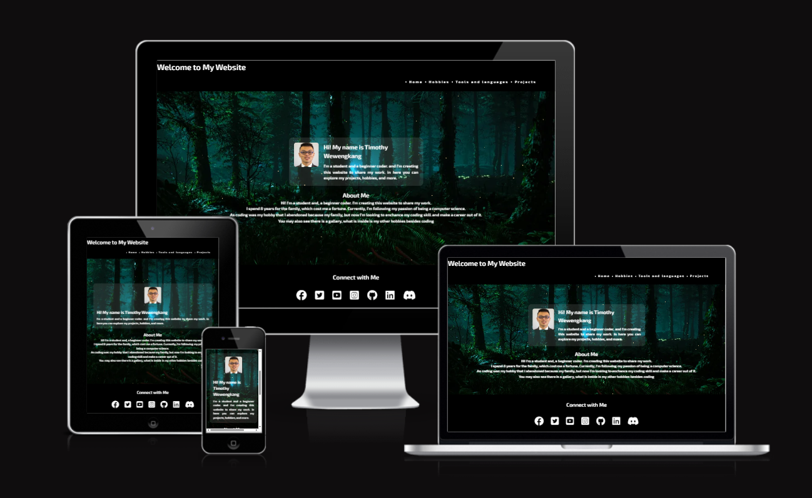

[Link](https://timothyyw.github.io/my-website/)

# Feature

## Home page (Index)

Within the homepage, are featured three navigation bars, and it is identical with other pages to ensure easy navigation for the user.

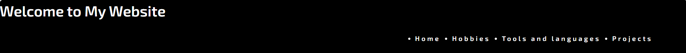

## Home page

Once loaded user will be greeted with welcome message, picture of me, and description that is telling a background about myself.

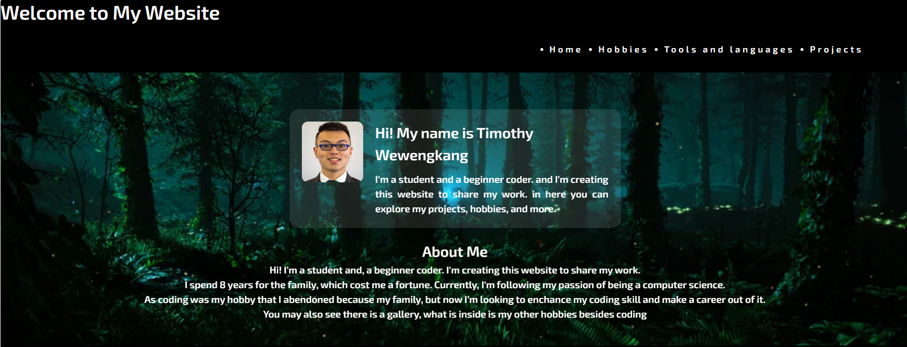

## Hero image

The hero image will be a background of nighttime within forest that is meant to represent peaceful night, since I love the quiet night and the peaceful feeling that is provided.

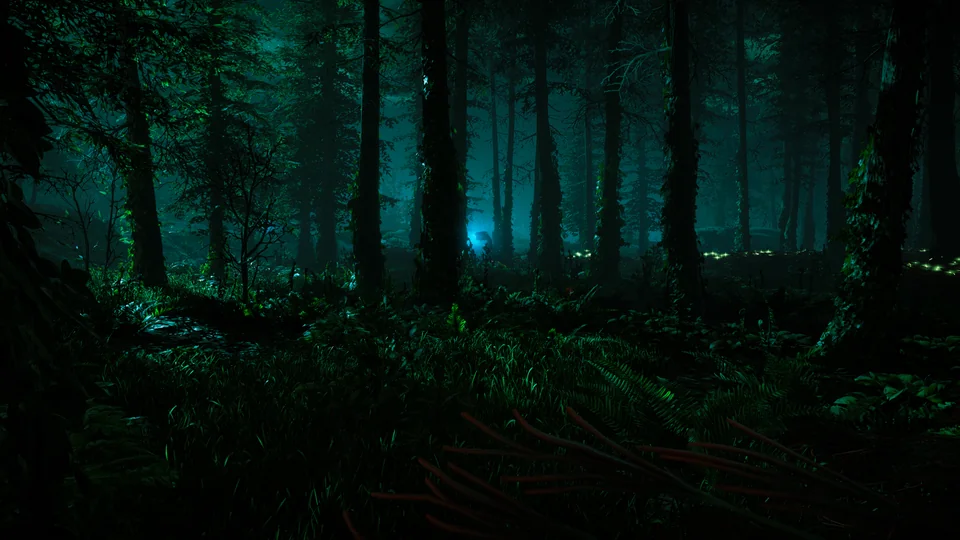

## Footer

The footer consist of quick link to allowed user to get connected with me through their preferable social media. There are social media that are for professional use, and there are some for fun use.

## Tools and languages

This page to showcase the tools and programming languages that I used including human language.

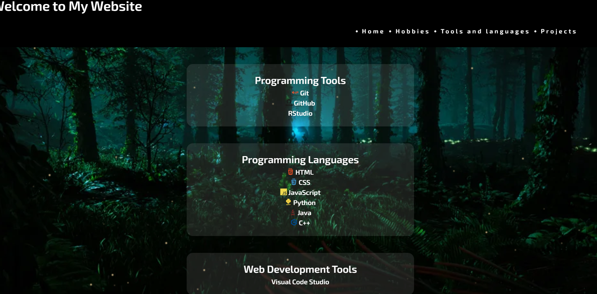

## Projects and connect successful

This page is allowing the user to connect with me and next page will show if they manage connect succesfully.

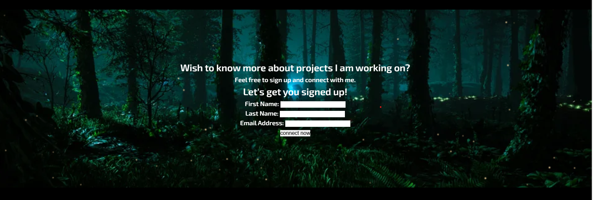

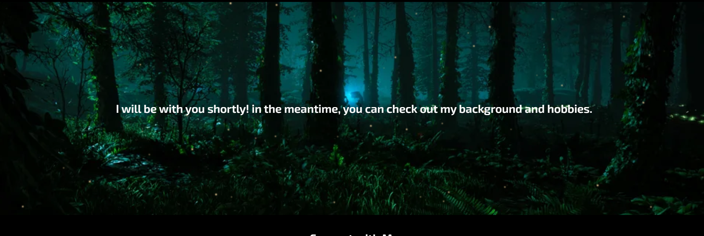

# Wireframe

the Wireframe can be view below:

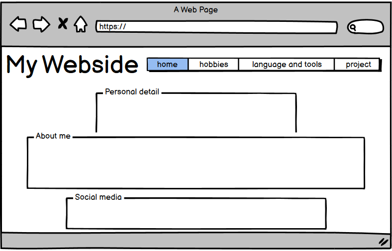

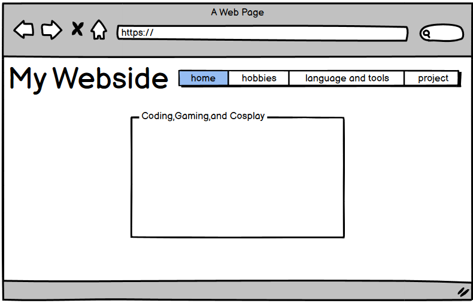

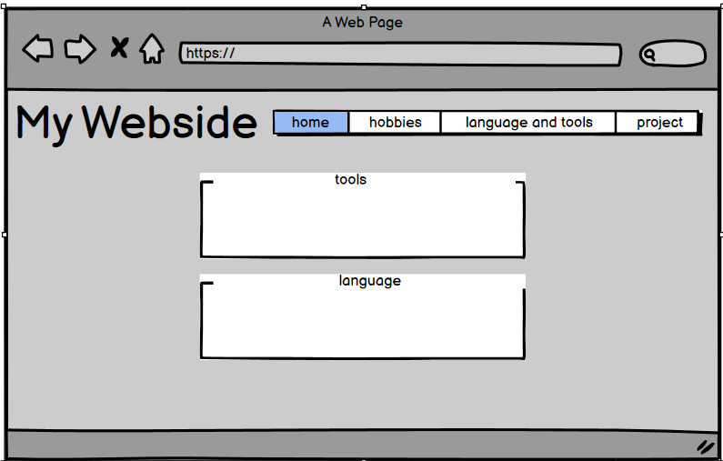

The wireframes are used as a sketch of the website how is it going to be expected to look.

## Technologies Utilized

HTML is used for write the code and to built the website.

CSS is used style the code.

Google Fonts is providing the style for the letter that is written and displayed on the website.

Github is where the code will be stored.

Google Chrome Lighthouse is used to check the website performance and accessibility.

Balsemig is used to make the sketch wireframes for the website strucutres.

W3C used to validated and ensured there are no errors on HTML code.

Jigsaw is to ensure that there are no error on the CSS code.

Wave is to check if there is color contrast.

# Test result

## HTML Test

As can be seen that the result test for Index HTML shows no error.

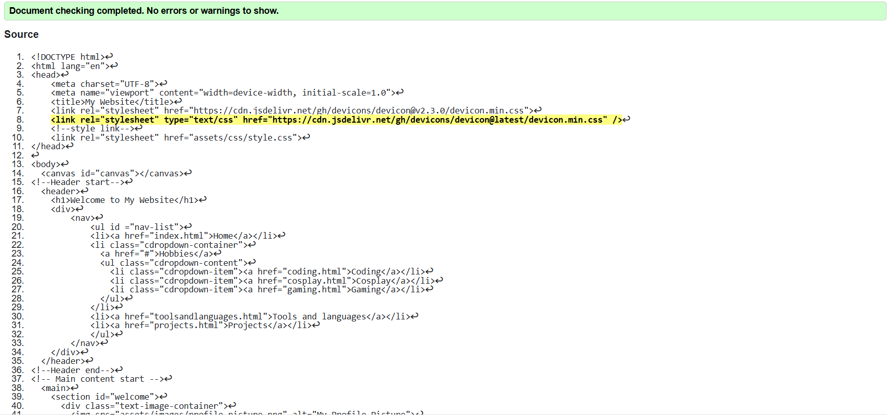

As can be seen the result test for tools and languages HTML shows no error.

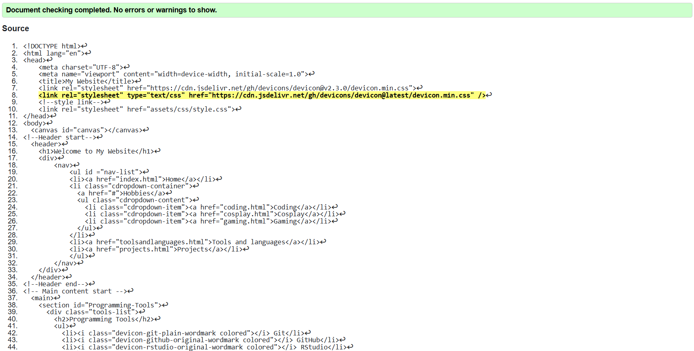

As can be seen the result test for projects HTML shows no error.

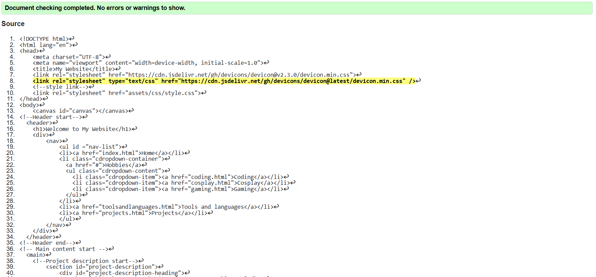

As can be seen the test result for gaming, cosplay, and coding html shows no error.

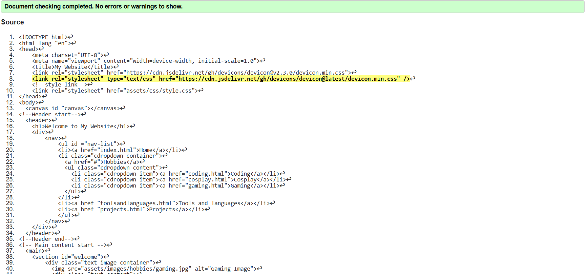

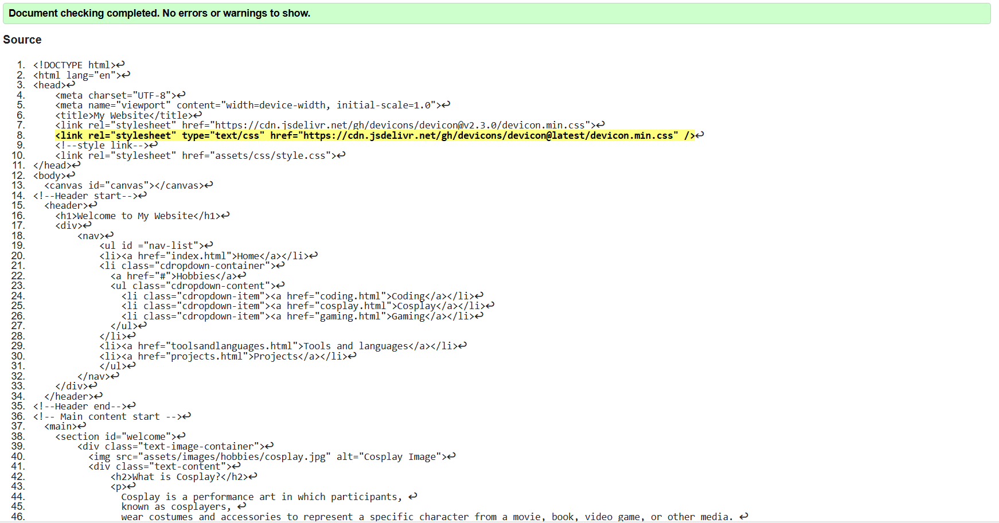

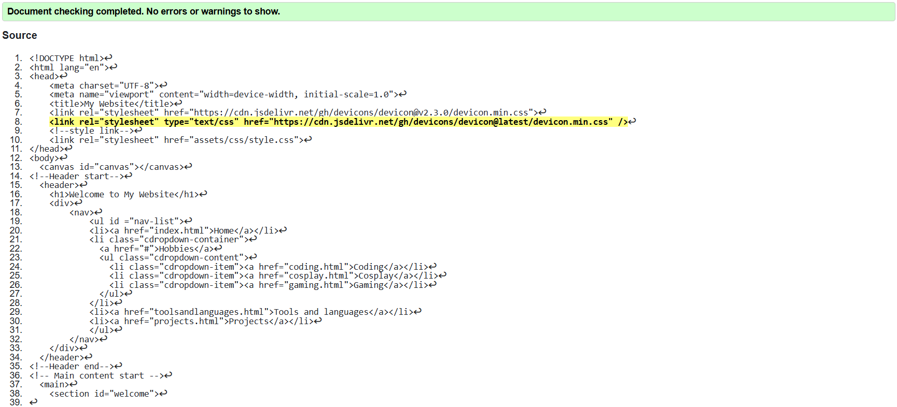

As can be seen here is the test for connect-successful.html.

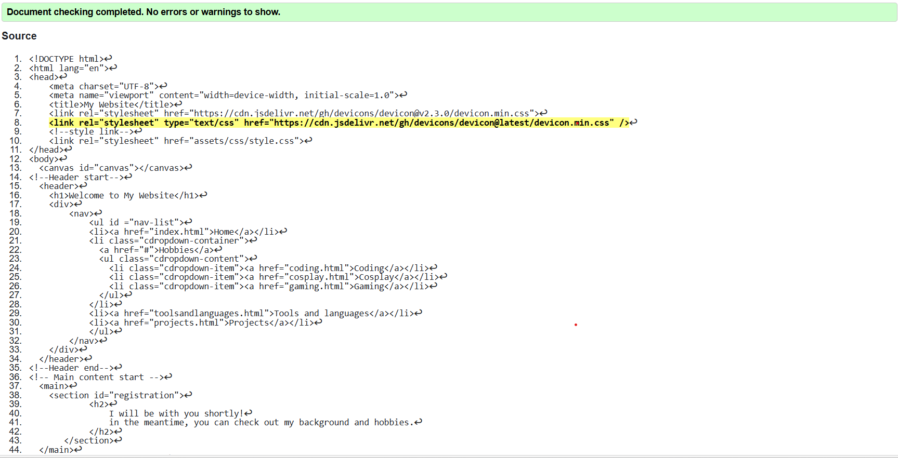

Finally, here is the test result for 404 error page.

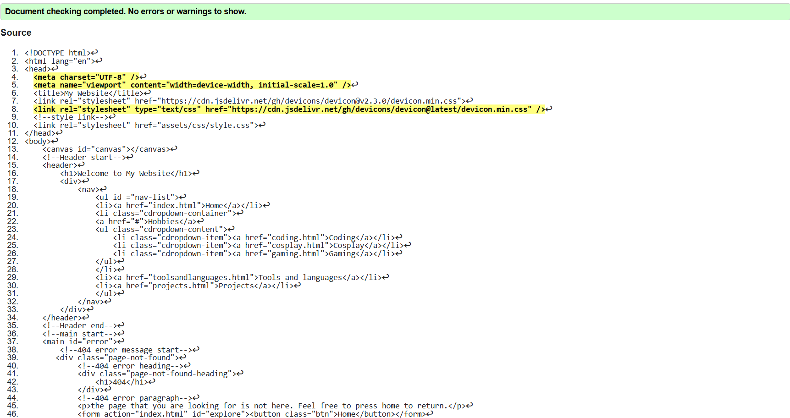

## CSS Test

As can be seen that the result of test for CSS shows no error.

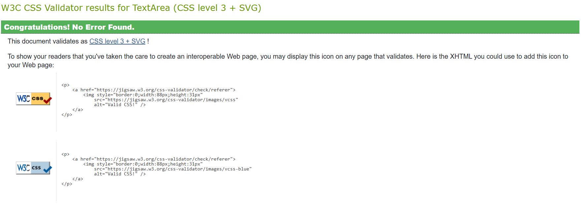

# Lighthouse speed test

As can be seen here is the lighthouse speed test for deskop.

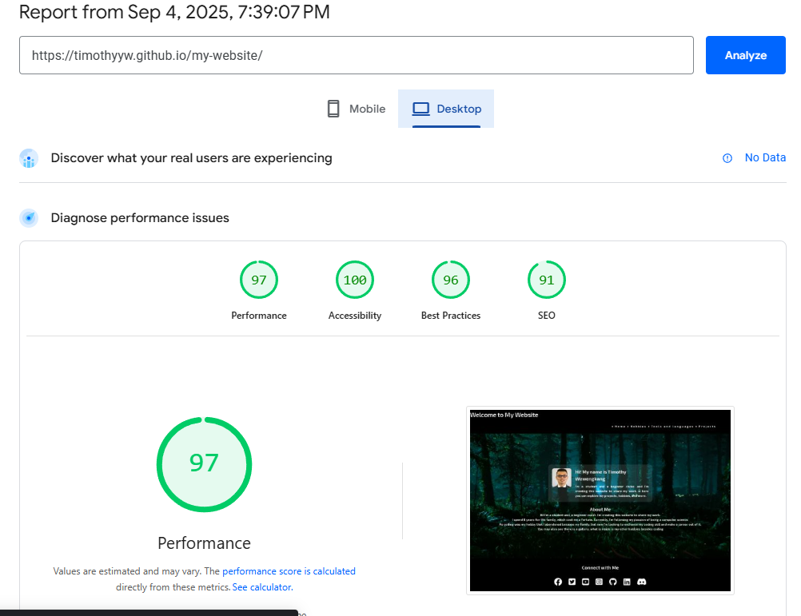

As can be seen here is the lighthouse speed test for mobile.

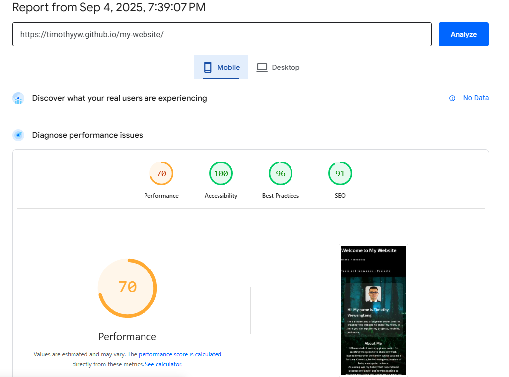

# Deployment

To deploy the project please follow step below:
    
    1. Log in to Github.
    2. Go to setting right next to Insight.
    3. Within setting navigate to Pages below Codespaces.
    4. Under the Branch, change from "none" to "main".
    5. Click "Save".
    6. Wait for few minute.
    7. A link will be provided.

## Version Control

To use version control utilizing the git command:

    1. Git add . will create a file with the new code that has been added
    2. Git commit is to commit the changes
    3. Git push is to add the version of the file in to the repository

After creating new version of the file it will be commited, which means it can be viewed and compared previous and newer version.

## Cloning Repository 

For cloning repository, can be done as followed:

    1. Open github repository
    2. Above file open drop down menu code copy URL, there are three version HTTP, SSH, and GitCLI, all version work on cloning.
    3. Open Git Bash.
    4. Type Git clone URL

# Credits

This website has taken inspiration from Love Running project and other portfolio website.

Thank you to Mr Tim Nelson for her guidance

Firefly

https://codepen.io/Mertl/pen/GexapP

Rainbow six siege website

https://timothyyw.github.io/Rainbow-six-siege-lore

Website inspiration 

https://kyuiki.com/

Agile inspiration

https://github.com/users/RadwanDuadu/projects/1/views/1

